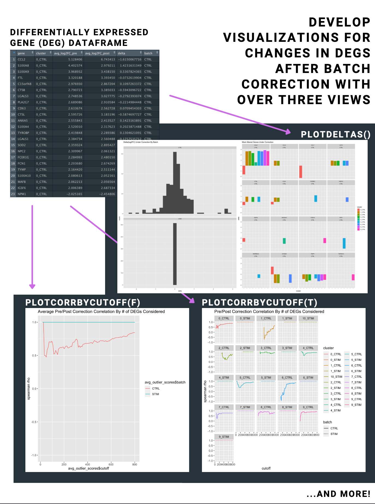

<!-- README.md is generated from README.Rmd. Please edit that file -->

```{r, include = FALSE}
knitr::opts_chunk$set(
  collapse = TRUE,
  comment = "#>",
  fig.path = "man/figures/README-",
  out.width = "100%"
)
```

# Integration Score

<!-- badges: start -->
<!-- badges: end -->

## Description

Biological data are obtained using different instruments, by different 
researchers, or under other different conditions. As a result non-biological 
variation between data sets is inevitable. This non-biologically (technical) 
variance is called a batch effect. 

When analyzing a data set with potential batch effects, one must be careful to 
first remove as much of this variation as possible. The process of removing 
batch effects is referred to as batch correction. If proper batch correction is 
not applied then the results of any downstream analyses performed may be 
useless, since there is no way for these downstream tasks to distinguish 
between real biological signal and batch-effect-related noise. 

On the other hand, it is also possible to over batch correct and inadvertently 
remove important biologically-relevant variation from the data. The process of 
merging data sets produced or measured under different conditions is called 
integration. Striking an appropriate balance with your batch correction 
algorithm and parameters is a vital step of integration.

Several R packages exist that score batch effects in a given data set. These 
scores are useful measures of how much batch effect may exist in a given data 
set. An example of such a score is kBET. kBET measures the mixing of batches by 
comparing the local distribution of batch labels in a sample of neighborhoods 
to the global distribution of batch labels.

The objective of IntegrationScore is to allow researchers working with scRNA-seq 
data to compare the effectiveness of batch correction methods using a different 
measure. That measure being: in a given batch, are the differentially expressed 
genes (DEGs) between clusters somewhat invariant under the batch correction 
method? A measure such as this gives researchers an idea of which genes were 
significantly changed by the correction algorithm. Additionally, this measure 
can be used to get a general picture of how the correction algorithm changed 
each cluster. This R package enables scientists to quickly perform this sanity 
check and interpret the results using clear visualizations.

IntegrationScore was developed on a Mac using R 4.1.1.

## Installation

You can install the development version of IntegrationScore from [GitHub](https://github.com/) with:

``` {r}
require("devtools")
devtools::install_github("eliaswilliams/IntegrationScore")
library("IntegrationScore")
```

To run the shinyApp:

```{r}
#runIntegrationScore()
```


## Overview
``` {r}
ls("package:IntegrationScore")
```
This package contains 5 functions available to users. It is recommended that 
users start by calling findDEG which returns a data frame of differentially 
expressed genes (DEGs) in your Seurat objects. corrDEG is then used to calculate 
the correlation of the DEGs under batch correction. The remaining three 
functions are for plotting. plotDelta returns a plot that illustrates change 
in log2FC (delta) under the correction algorithm. plotCorrByCutoff shows how the 
correlation of the DEGs changes as you consider more or less DEGs. And finally, 
plotUMAP plots the UMAP reduction pre and post batch correction.




``` {r}
browseVignettes("IntegrationScore")
```

## Contributions

The author of this package is Elias Williams. All functions make use of the 
Seurat library for single-cell analysis. ggplot2 is used for plotting functions.
Seurat's integration vignette is borrowed from in this package's vignette, and 
it is attributed there. The vignette also makes use of a sample data set from 
the SeuratData package.

## References

Büttner, M., Miao, Z., Wolf, F.A. et al. (2019) A test metric for assessing single-cell RNA-seq batch correction. Nat Methods 16, 43–49. https://doi.org/10.1038/s41592-018-0254-1

Hoffman, P. (2021) Satija Lab. Introduction to scRNA-seq integration. https://satijalab.org/seurat/articles/integration_introduction.html

Satija, R. (2021) Satija Lab. Seurat Data R Package. https://github.com/satijalab/seurat-data

Wickham, H. and Bryan, J. (2019). R Packages (2nd edition). Newton, Massachusetts: O’Reilly Media. https://r-pkgs.org/

## Acknowledgements

This  package  was  developed  as  part  of  an  assessment  for  2021  BCB410H:  Applied  Bioinfor-matics, University of Toronto, Toronto, CANADA.


